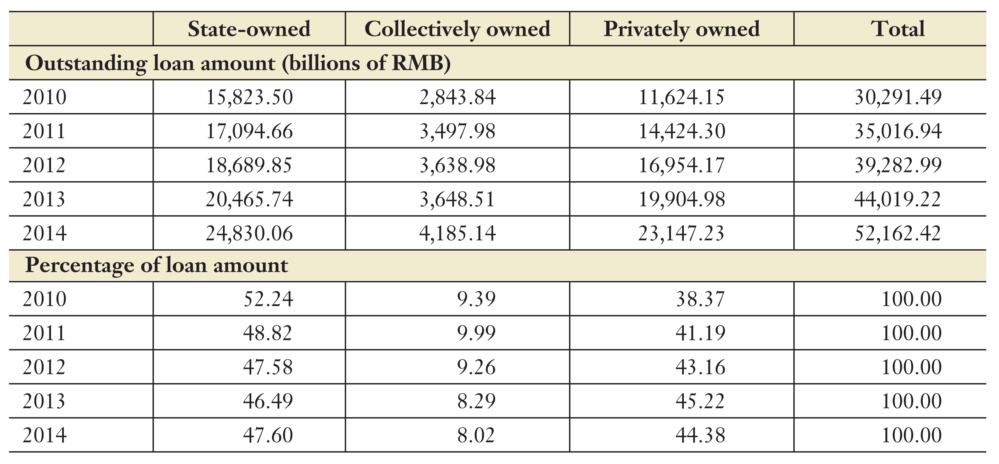
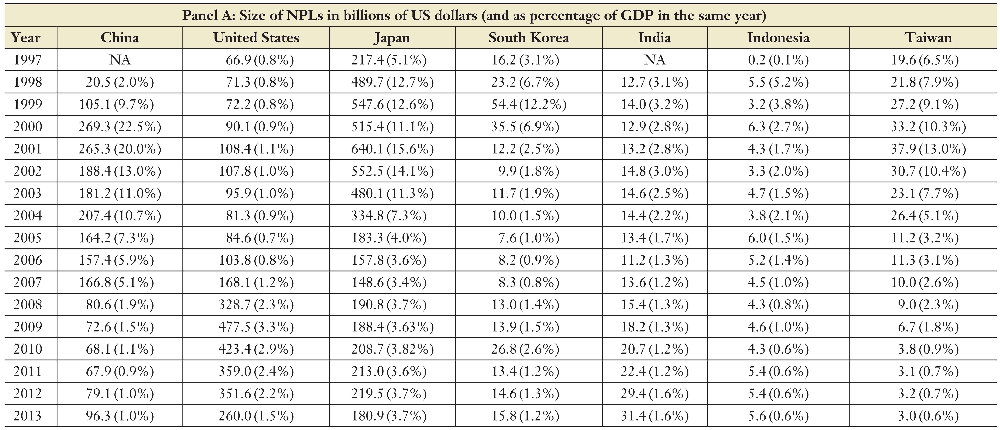

```{r include=FALSE}
library(knitr)

opts_chunk$set(dpi = 300, fig.align = "center", fig.width = 6, fig.height = 4, message = F, error = F, warning = F)

library(tidyverse)
library(readxl)
library(ggthemes)
library(htmlTable)
library(extrafont)
library(foreign)
library(plotly)
library(lubridate)
library(png)

loadfonts(device = "win")

theme_set(theme_minimal(base_size = 15, base_family = "STZhongsong"))

theme_update(
    panel.background = element_blank(),
    panel.grid.minor = element_blank(), 
    panel.grid.major = element_line(color = "gray50", size = 0.5),
    panel.grid.major.x = element_blank(),
    axis.ticks.length = unit(.25, "cm"),
    axis.ticks.x = element_line(colour = "gray50"),
    axis.ticks.y = element_blank(),
    axis.line.x = element_line(color = "gray50", size = 0.5)
)
```

## 中国金融行业发展

```{r echo=FALSE}
vafin_china <- read_excel("data/VAFin_China.xlsx")

ggplot(vafin_china, aes(x = year))+
  geom_line(aes(y = GDP/10000), color = "darkblue", size = 1.5) +
  geom_line(aes(y = Fin_VA*10/10000), color = "darkorange", size = 1.5) + 
  labs(title = "行业增加值", subtitle = "1952-2016年", x = "", y = "GDP(万亿元)", caption = "数据来源: 中国统计局") +
  scale_x_continuous(breaks = c(1952, seq(1960, 2010, 10), 2016)) +
  scale_y_continuous(sec.axis = sec_axis(~./10, name = "金融增加值(万亿元)")) +
  theme(
    axis.title.y = element_text(color = "darkblue"), 
    axis.text.y = element_text(color = "darkblue"),
    axis.title.y.right = element_text(color = "darkorange"),
    axis.text.y.right = element_text(color = "darkorange")
    )
```

<!-- --- -->

<!-- ## 概念: 行业增加值与GDP -->

<!-- - 行业增加值: 按市场价格计算的一个国家（或地区）所有常住单位在一定时期内从事某行业生产活动的最终成果 -->

<!-- - GDP与行业增加值核算方法: 生产法, 收入法和支出法 -->

<!-- - 根据生产法: GDP = 各行业增加值之和 -->

<!-- --- -->

<!-- ## 金融业增加值核算方法 -->

<!-- ```{r echo=FALSE} -->
<!-- include_graphics("pics/FinVA_Cal.png") -->
<!-- ``` -->

<!-- - 核心部分: -->
<!--     - 劳动者报酬 -->
<!--     - 营业盈余 -->

---

## 中国金融行业增长
  
```{r echo=FALSE}
ggplot(vafin_china, aes(x = year, y = Fin_ratio/100)) + 
  geom_line(size = 1.2, color = "darkblue") +
  geom_point(data = vafin_china %>% filter(year == 1978), size = 3, color = "darkorange") +
  geom_point(data = vafin_china %>% filter(year == 1989), size = 3, color = "darkorange") +
  geom_point(data = vafin_china %>% filter(year == 2005), size = 3, color = "darkorange") +
  labs(title = "金融行业增加值占GDP比例", subtitle = "1952-2016年", x = "", y = "金融行业增加值 / GDP", caption = "数据来源: 中国统计局") +
  scale_x_continuous(breaks = c(1952, seq(1960, 2010, 10), 2016))
```

---

## 金融行业增长, 跨国比较(I)

```{r echo=FALSE, out.width=700}
include_graphics("pics/VAFin_Intl1.png")
```
.remark-small[Source: Philippon & Reshef (2013)]

---

## 金融行业增长, 跨国比较(II)

```{r echo=FALSE, out.width=700}

```
.remark-small[Source: Philippon & Reshef (2013)]

---

## 法律与金融体系，国际比较

```{r echo=FALSE, out.width=680}

```
.remark-small[Source: Allen, Qian & Qian (2005)]

---

## 中国金融体系现状

```{r echo=FALSE, out.width=680}

```
.remark-small[Source: Allen, Qian & Gu (2017)]

---

## 中国金融体系演变(I)

- 1950-1977
    - 一家银行：中国人民银行
    - 职能：中央银行、商业银行
    - 控制93%的金融资产，管理几乎所有的金融业务

- 1978-1987
    - 1977年，中国银行成立，外汇业务
    - 1979年，中国农业银行成立，农村金融服务
    - 1984年，中国工商银行成立，城市金融服务
    - 1987年，中国建设银行成立，固定资产业务

---

## 中国金融体系演变(II)

- 1990-2004
    - 1990年12月，上海与深圳证券交易所成立
    - 1998年，城镇住房制度改革
    - 1999年，成立四大银行的资产管理公司
    - 2003年，中国银监会成立

- 2005至今
    - 2005年，股权分置改革
    - 2015年，公司债发行新规
    - 2018年，中国银保监会成立
    - 科创板？

---

## 社会融资规模的构成

- 间接金融占主导
- 2009年后影子银行飞速发展

```{r echo=FALSE, out.width=800}
  
```
.remark-small[Source: Allen, Qian & Gu (2017)]

---

## 银行资产规模

- 国有银行占主导

```{r echo=FALSE, out.width=800}

```
.remark-small[Source: Allen, Qian & Gu (2017)]

---

## 银行贷款流向

- 主要流向国有部门

```{r echo=FALSE, out.width=700}

```
.remark-small[Source: Allen, Qian & Gu (2017)]

---

## 银行不良贷款率

- 2000年后不良贷款率逐步下降

```{r echo=FALSE, out.width=800}

```
.remark-small[Source: Allen, Qian & Gu (2017)]

---

## 影子银行的兴起背景

```{r echo=FALSE, out.width=500}

```
.remark-small[Source: Chen, Ren & Zha (2018)]

---

## 中国式影子银行

```{r echo=FALSE, out.width=600}

```
.remark-small[Source: Chen, Ren & Zha (2018)]

---

## 应收款项类投资(ARIX)

```{r echo=FALSE, out.width=600}

```
.remark-small[Source: Chen, Ren & Zha (2018)]

---

## 中国股票市场市值

```{r echo=FALSE}
trdyear <- read_excel("data/TRD_Year.xlsx")

trdyear2 <- trdyear %>% 
  mutate(
    exchcd = case_when(
      substr(Stkcd, 1, 1) == "0" & substr(Stkcd, 1, 3) != "002" ~ "3",
      substr(Stkcd, 1, 3) == "002" ~ "2",
      substr(Stkcd, 1, 1) == "3" ~ "1",
      substr(Stkcd, 1, 1) == "6" ~ "3",
      TRUE ~ NA_character_
    )
  ) %>% 
  filter(!is.na(exchcd))

trdyear2 %>%
  group_by(Trdynt, exchcd) %>% 
  summarise(mktcap = sum(Ysmvttl)/1e9) %>% 
  mutate(
    year = parse_number(Trdynt)
  ) %>% 
  filter(year <= 2016) %>% 
  ggplot(aes(x = year, y = mktcap)) +
  geom_area(aes(fill = factor(exchcd, labels = c("创业板", "中小企业板", "主板")))) +
  labs(x = "", y = "市值(万亿元)", caption = "数据来源: CSMAR", fill = "") +
  scale_x_continuous(breaks = seq(1990, 2015, 5)) +
  scale_fill_brewer(palette = "Set2")
```

---

## 股票市场回报率

```{r echo=FALSE, out.width=700}

```
.remark-small[Source: Allen, Qian & Gu (2017)]

---

## 国有企业民营化发行

- 背景: 国企改革
    - 1979-1983, 放权让利(保留3%利润)
    - 1983-1986, 利改税, 拨改贷
    - 1987-1991, 承包制(包死基数、确保上交、超收多留、歉收自补)
    - 1992之后, 现代企业制度
    - 1995, "抓大放小"(100家央企, 2600家地方企业)

- 2000年末, 1080家上市企业, 大部分都是国企

---

## 股权分置

- 国家股和法人股不流通
```{r echo=FALSE, out.width=420}
include_graphics("pics/slitshare_China.png")
```
- 同股不同权
```{r echo=FALSE, out.width=420}

```

---

## 股权分置改革

- 1999-2001, 尝试以市价减持国有股, 以失败告终

- 2005: 证监会《关于上市公司股权分置改革试点有关问题的通知》
    - 2/3非流通股股东同意出售股份
    - 非流通股股东与买方协商股权分置改革方案, 并报证监会批准
    - 转让股份为限售股
        <!-- - 1年禁售期 -->
        <!-- - 1年后可抛售5% -->
        <!-- - 2年后可抛售10% -->
        <!-- - 3年后可抛售全部 -->
        
---

## A股上市公司国有企业比例

```{r echo=FALSE}
eqnature <- read_excel("data/EN_EquityNatureAll.xlsx")

eqnature1 <- eqnature %>% 
  mutate(
    EndDate = ymd(EndDate),
    year = year(EndDate)
    ) %>% 
  filter(year >= 2000, year <= 2015)

eqnature1 %>% 
  filter(!is.na(EquityNatureID)) %>% 
  mutate(
    eqnature = if_else(EquityNatureID == "1,2" | EquityNatureID == "1,3" | EquityNatureID == "2,3"| EquityNatureID == "1,2,3", "其他", EquityNature)
  ) %>% 
  count(year, eqnature) %>% 
  ggplot(aes(x = year, y = n)) +
  geom_area(aes(fill = factor(eqnature, levels = c("其他", "外资", "民营", "国企"))), position = "fill") +
  labs(x = "", y = "上市公司所有者属性占比", caption = "数据来源: CSMAR", fill = "所有者属性") +
  scale_x_continuous(breaks = seq(2003, 2015, 5)) +
  scale_fill_brewer(palette = "PuBuGn")
```

---

## 上市与退市制度

- 上市制度
    - 证券市场成立之初: 审批制
        - 90年代初: "额度管理"
        - 1997: "总量控制, 限报家数"
    - 1999年《证券法》: 核准制, 承销商推荐, 发审委投票通过("过会") 
    - 上市条件(2001年至今): 最近三年净利润均为正

- 退市制度
    - ST: 公司经营连续二年亏损，特别处理
    - *ST: 公司经营连续三年亏损，退市预警
    - 过程是可逆的
    
---

## 上市公司ROE分布

```{r echo=FALSE}
include_graphics("pics/ROEdist.png")
```
.remark-small[来源：张红、汪小圈 (2018)]

---

## 上市公司投资回报率

```{r echo=FALSE, out.width=400}

```

```{r echo=FALSE, out.width=400}

```
.remark-small[Source: Allen, Qian, Shan & Zhu (2018)]

---

## 中国债券市场

```{r echo=FALSE, out.width=700}

```
.remark-small[Source: Allen, Qian & Gu (2017)]

---

## 中国房地产市场资金来源

```{r echo=FALSE, out.width=600}
include_graphics("pics/Realestate_fund.png")
```
.remark-small[Source: Allen, Qian & Gu (2017)]

---

## 中国一线城市房价

```{r echo=FALSE, out.width=700}

```
.remark-small[Source: Fang, Gu, Xiong & Zhou (2015)]

---

## 中国二三线城市房价

```{r echo=FALSE, out.width=700}

```
.remark-small[Source: Fang, Gu, Xiong & Zhou (2015)]

---

## 参考文献

.remark-ref[
- Allen, F., Qian, J., & Qian, M. (2005). Law, finance, and economic growth in china. Journal of Financial Economics, 77(1), 57-116.

- Allen, F., Qian, J., & Gu, X. (2017). An overview of china's financial system. Annual Review of Financial Economics, 9(1), 191-231.

- Allen, F., Qian, J., Shan, C., & Zhu, J. (2018) Dissecting the Long-term Performance of the Chinese Stock Market. Working paper.

- Chen, K., Ren, J., & Zha, T. (2018). The nexus of monetary policy and shadow banking in china. American Economic Review, 108(12), 3891-3936.

- Fang H., Gu Q., Xiong W., Zhou L-A. (2015). Demystifying the Chinese housing boom. NBER Working Paper No.21112

- Philippon, T., & Reshef, A. (2013). An international look at the growth of modern finance. The Journal of Economic Perspectives, 27(2), 73-96.
]