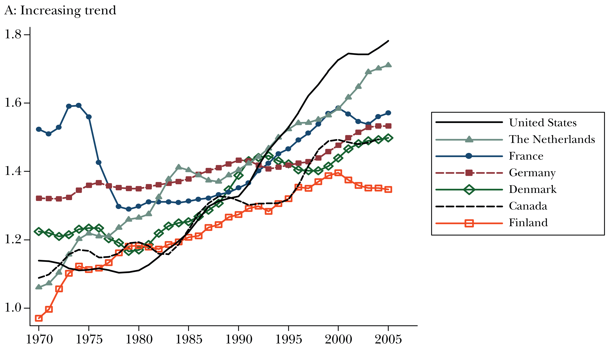
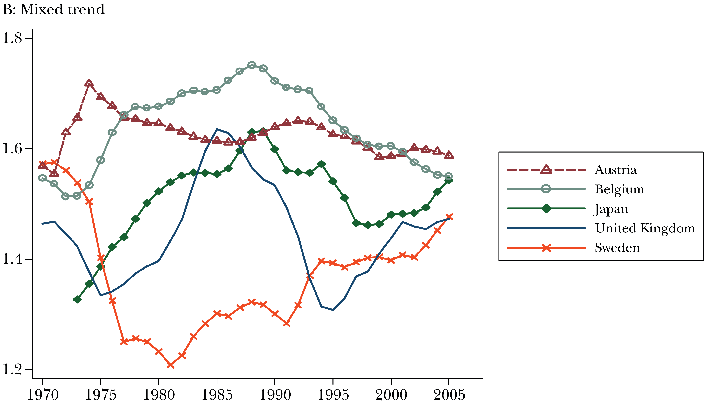
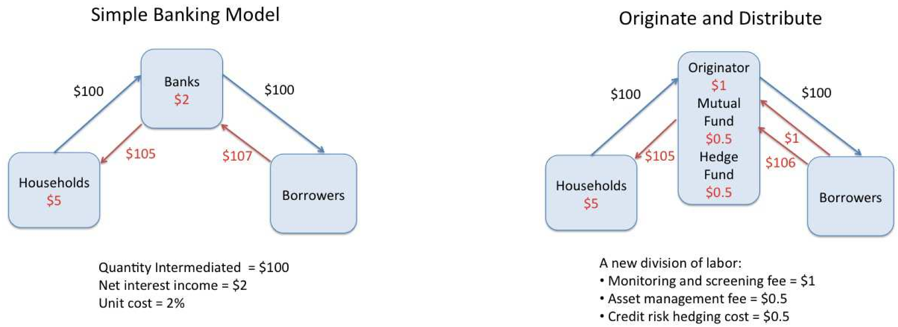
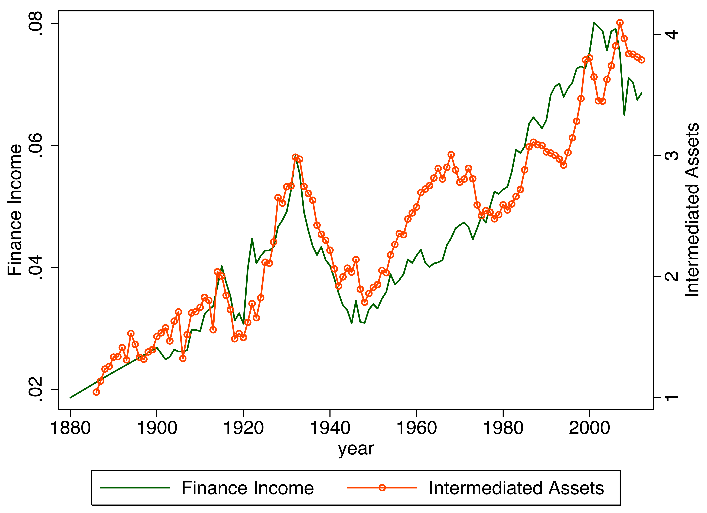
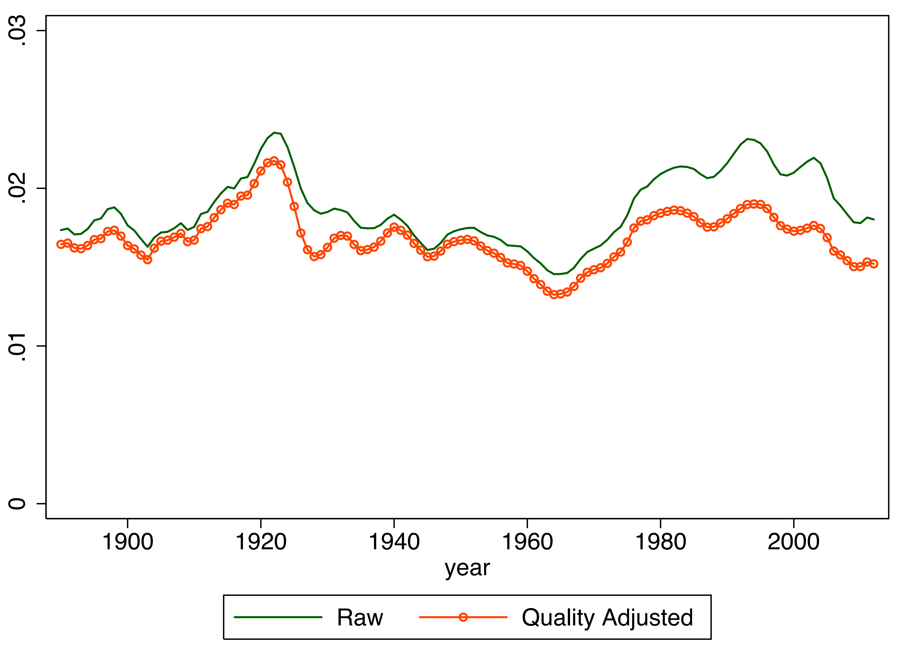

```{r include=FALSE}
library(knitr)

opts_chunk$set(dpi = 300, fig.align = "center", fig.width = 6, fig.height = 4, message = F, error = F, warning = F)

library(tidyverse)
library(readxl)
library(ggthemes)
library(ggrepel)
library(htmlTable)
library(extrafont)
library(foreign)
library(plotly)
library(lubridate)
library(png)

loadfonts(device = "win")

theme_set(theme_minimal(base_size = 15, base_family = "STZhongsong"))

theme_update(
    panel.background = element_blank(),
    panel.grid.minor = element_blank(), 
    panel.grid.major = element_line(color = "gray50", size = 0.5),
    panel.grid.major.x = element_blank(),
    axis.ticks.length = unit(.25, "cm"),
    axis.ticks.x = element_line(colour = "gray50"),
    axis.ticks.y = element_blank(),
    axis.line.x = element_line(color = "gray50", size = 0.5)
)
```

## 中国金融行业增长
  
```{r echo=FALSE}
vafin_china <- read_excel("data/VAFin_China.xlsx")

ggplot(vafin_china, aes(x = year, y = Fin_ratio/100)) + 
  geom_line(size = 1.2, color = "darkblue") +
  geom_point(data = vafin_china %>% filter(year == 1978), size = 3, color = "darkorange") +
  geom_point(data = vafin_china %>% filter(year == 1989), size = 3, color = "darkorange") +
  geom_point(data = vafin_china %>% filter(year == 2005), size = 3, color = "darkorange") +
  labs(title = "金融行业增加值占GDP比例", subtitle = "1952-2016年", x = "", y = "金融行业增加值 / GDP", caption = "数据来源: 中国统计局") +
  scale_x_continuous(breaks = c(1952, seq(1960, 2010, 10), 2016))
```

---

## 中国行业平均工资

```{r echo=FALSE, height=800}
payfin_china <- read_excel("data/laborpay_Fin_China.xlsx")

payfin_china %>% 
  gather(key, value, wage, fin_wage) %>% 
  ggplot(aes(x = year, y = value/10000, color = key))+
  geom_line(size = 1.2) +
  labs(title = "行业年平均工资", subtitle = "2003-2016年", x = "", y = "每年平均工资(万元)", caption = "数据来源: 中国统计局") +
  scale_x_continuous(breaks = seq(2002, 2016, 2)) +
  scale_color_manual(name="行业", 
                     labels = c("金融行业", "所有行业"), 
                     values=c("darkorange", "darkblue")) 

```

---

## 中国金融行业相对工资

```{r echo=FALSE}
ggplot(payfin_china, aes(x = year, y = rel_wage)) + 
  geom_line(size = 1.2, color = "darkblue") +
  geom_point(data = payfin_china %>% filter(year == 2008), size = 3, color = "darkorange") +
  labs(title = "金融行业平均工资与所有行业平均工资之比", subtitle = "2003-2016年", x = "", y = "金融行业工资 / 所有行业工资", caption = "数据来源: 中国统计局") +
  scale_x_continuous(breaks = seq(2002, 2016, 2))
```

---

## 金融行业相对工资, 跨国比较(I)

```{r echo=FALSE}

```
.remark-small[Source: Philippon & Reshef (2013)]

---

## 金融行业相对工资, 跨国比较(II)

```{r echo=FALSE}

```
.remark-small[Source: Philippon & Reshef (2013)]

---

## 中国金融类企业营业利润增长
```{r echo=FALSE}
library(tibbletime)

comins <- read_csv("data/CSMAR/FS_Comins.csv")
comfile2 <- read_csv("data/CSMAR/TRD_Co.csv")
comfile1 <- read_xls("data/CSMAR/TRD_Co_old.xls") %>% 
  type_convert(
    cols(
  .default = col_character(),
  Cuntrycd = col_integer(),
  Stkcd = col_integer(),
  Indcd = col_integer(),
  Ipoprm = col_double(),
  Ipoprc = col_double(),
  Nshripo = col_integer(),
  Parval = col_integer(),
  Sctcd = col_integer(),
  Crcd = col_integer(),
  Commnt = col_integer(),
  Markettype = col_integer()
    )
  )

comfile <- comfile1 %>% 
  bind_rows(comfile2) %>% 
  distinct(Stkcd, .keep_all = T)

comins <- comins %>% 
  mutate(
    Accper = ymd(Accper),
    year = year(Accper)
    ) %>% 
  # as_tbl_time(Accper) %>% 
  filter(month(Accper) == 12, Typrep == "A", year<=2016, Stkcd<=9e5)

# levels(as.factor(com_full %>% filter(Indcd==1) %>% .$Nindnme))

com_full <- comins %>% 
  left_join(comfile) %>%
  mutate(
    fin = if_else(Indcd==1, 1, 0), 
    Nindnme = factor(Nindnme, levels = c("保险业", "金融信托业", "其他金融业", "证券、期货业", "银行业"))
  )

com_full %>% 
  group_by(year, fin) %>% 
  summarise(tot_EBIT = sum(EBIT)) %>% 
  ggplot(aes(x = year, y = tot_EBIT/1e12)) +
  geom_area(aes(fill = factor(fin, levels = c("1", "0"), labels = c("金融", "其他")))) +
  labs(title = "A股上市企业行业利润总额", subtitle = "2000-2016年", x = "", y = "行业利润总额(万亿元)", caption = "数据来源: CSMAR", fill = "行业") 
  # scale_fill_manual(name="行业",
  #                   breaks = c("金融", "其他"),
  #                   values = c("金融" = "darkblue", "其他"="darkorange"))
```

---

## 金融类上市企业营业利润分布
  
```{r echo=FALSE}
com_full %>% 
  filter(fin==1) %>% 
  group_by(year, Nindnme) %>% 
  summarise(ind_EBIT = sum(EBIT)) %>% 
  ggplot() +
  geom_area(aes(x = year, y = ind_EBIT/1e12, fill = Nindnme)) +
  labs(title = "A股金融类上市企业利润分布", subtitle = "2000-2016年", x = "", y = "金融子行业利润总额(万亿元)", caption = "数据来源: CSMAR", fill = "金融子行业")

```

---

## 银行业上市企业营业收入来源

```{r echo=FALSE}
com_full %>% 
  filter(Nindcd=="I01") %>% 
  group_by(year) %>% 
  summarise(`利息收入` = sum(Interest), `中间业务收入` = sum(Interim)) %>% 
  gather(key, value, `利息收入`, `中间业务收入`) %>% 
  ggplot() +
  geom_area(aes(x = year, y = value/1e12, fill = key)) +
  labs(title = "A股银行业上市企业营业收入", subtitle = "2000-2016年", x = "", y = "银行业收入总额(万亿元)", caption = "数据来源: CSMAR", fill = "收入来源") 
  #scale_fill_manual(name="收入来源", 
  #                  labels = c("利息收入", "中间业务收入")) 
```


---

## 行业增加值恒等式

金融行业增加值 = 

金融资产（规模） * 

金融资产单位成本（效率）

---

## 金融中介的成本

```{r echo=FALSE}

```
.remark-small[Source: Philippon (2015)]

---

## 金融资产的存量与流量

- 资金使用者: 居民, 非金融企业

- 类别: 贷款, 股权, 债权, 流动性提供者

- 存量 v.s. 流量
    - 存量: 贷款余额 + 债券市值 + 股票市值 + 银行理财产品余额 + 货币共同基金市值
    - 流量: 新增贷款 + 债券市场新增发行额 + 3.5 * 股票市场新增发行额 + 并购重组金额

---

## 金融资产分布

```{r echo=FALSE}
fin_eff <- read_csv("data/fin_eff.csv") %>% 
  mutate_all(as.numeric) %>% 
  mutate_at(vars(-year), ~if_else(is.na(.), 0, .)) %>% 
  mutate(
    `债券市值` = `国债余额` + `非金融企业债余额`,
    `股票发行额` = IPO + `增发配股`,
    `债券发行额` = `国债发行额` + `非金融企业债发行额`,
    `金融资产` = `各项贷款余额` + `股票市值` + `债券市值` + `银行理财产品` + `货币基金` + 3.5*`股票发行额` + `债券发行额`, 
    `金融效率` = VA / `金融资产`
  )

fin_eff %>% 
  mutate_at(vars(`货币基金`, `银行理财产品`, `股票市值`, `债券市值`, `各项贷款余额`, `债券发行额`, `股票发行额`), ~./fin_eff$GDP) %>% 
  gather(key, value, `股票发行额`, `债券发行额`, `货币基金`, `银行理财产品`, `股票市值`, `债券市值`, `各项贷款余额`) %>% 
  ggplot() +
  geom_area(aes(x = year, y = value, fill = factor(key, levels = c("债券发行额", "股票发行额", "货币基金", "银行理财产品", "债券市值", "股票市值", "各项贷款余额")))) +
  labs(title = "各金融资产与GDP比值", subtitle = "1978-2015年", x = "", y = "金融资产/GDP", caption = "数据来源: 中国统计局, WIND, CSMAR", fill = "类型") 

```

---

## 金融资产单位成本

```{r echo=FALSE}
fin_eff %>% 
  ggplot(aes(x = year, y = `金融效率`)) + 
  geom_line(size = 1.2, color = "darkblue") +
  geom_point(data = fin_eff %>% filter(year == 1989), size = 3, color = "darkorange") +
  geom_point(data = fin_eff %>% filter(year == 2005), size = 3, color = "darkorange") +
  labs(title = "金融资产单位成本", subtitle = "1978-2016年", x = "", y = "金融行业增加值 / 金融资产", caption = "数据来源: 中国统计局, WIND, CSMAR") 

```

---

## 美国金融增加值与金融资产

```{r echo=FALSE, out.width=600}

```
.remark-small[Source: Philippon (2015)]

---

## 美国金融资产单位成本

```{r echo=FALSE, out.width=600}

```
.remark-small[Source: Philippon (2015)]

---

## 中国金融资产成本, 跨区域比较

```{r echo=FALSE, out.width=7, out.height=5}
finance <- read_xlsx("data/city finance.xlsx", sheet = "finance info")
city <- read_xlsx("data/city finance.xlsx", sheet = "city info")
gdp_data <- read_xlsx("data/fin_data.xlsx")%>% 
  mutate(
    prov_name = prov_name %>% str_extract("^.{2}")
    )

fin_asset <- finance %>% 
  left_join(city) %>% 
  mutate(
    provincename = provincename %>% str_extract("^.{2}")
  )

full <- fin_asset %>% 
  group_by(year, provincename) %>% 
  summarise_at(vars(GDP, stk_cap, loan, bond), ~sum(., na.rm = T)) %>% 
  left_join(gdp_data, by = c("provincename"="prov_name", "year"="指标")) %>% 
  mutate(
    fin_VA = `金融业增加值(亿元)`/`地区生产总值(亿元)`,
    fin_asset = (stk_cap + loan + bond) / GDP,
    fin_eff = fin_VA / fin_asset
    ) 

full %>% 
  group_by(provincename) %>% 
  summarise_at(vars(fin_VA, fin_asset, fin_eff), ~mean(., na.rm = T)) %>%   mutate(
    provincename = if_else(provincename == "黑龙", "黑龙江", provincename),
    provincename = if_else(provincename == "内自", "内蒙古", provincename)
  ) %>%
  ungroup() %>%
  filter(provincename != "内蒙古") %>%
  ggplot(aes(x = fin_VA, y = fin_eff)) +  
    geom_point(aes(size = fin_asset), alpha = 0.8, color = "orange") +
    geom_text_repel(aes(label = provincename)) +
    scale_size(range = c(1, 10)) +
    labs(x = "金融行业增加值", y = "金融中介成本")+
    theme(legend.position="none")

#ggsave("FIC_China.png", width = 15, height = 10, units = "cm", dpi=300)

#######

prov_location <- tibble(
  `东部沿海地区` = "北京、天津、河北、辽宁、上海、江苏、浙江、福建、山东、广东、广西、海南、重庆、大连、宁波、厦门、青岛、深圳",
  `中部内陆地区` = "山西、内蒙古、吉林、黑龙江、安徽、江西、河南、湖北、湖南",
  `西部边远地区` = "四川、贵州、云南、西藏、陕西、甘肃、青海、宁夏、新疆"
) %>% 
  gather(`经济带划分`, prov_name, everything()) %>% 
  mutate(
    prov_name = prov_name %>% str_split("、")
  ) %>% 
  unnest()

#######

p <- full %>% 
  mutate(
    provincename = if_else(provincename == "黑龙", "黑龙江", provincename),
    provincename = if_else(provincename == "内自", "内蒙古", provincename)
  ) %>%
  left_join(prov_location, by = c("provincename"="prov_name")) %>% 
  select(provincename, year, fin_VA, fin_asset, fin_eff, `经济带划分`) %>% 
  drop_na() %>%
  ungroup() %>%
  filter(provincename != "西藏") %>%
  ggplot(aes(x = fin_VA, y = fin_eff, frame = year)) +  
    geom_point(aes(size = fin_asset, fill = `经济带划分`), alpha = 0.6, color = "white") +
    geom_text(aes(label = provincename)) +
    scale_size(range = c(1, 25)) +
    labs(x = "金融行业增加值", y = "金融资产单位成本", caption = "数据来源: 中国统计局, WIND, CSMAR")

ggplotly(p) %>% animation_opts(frame = 1000) %>% 
  layout(showlegend = TRUE)
  
```

---

## 参考文献

.remark-ref[
- Philippon, T. (2015). Has the US finance industry become less efficient? On the theory and measurement of financial intermediation. The American Economic Review, 105(4), 1408-1438. 

- Philippon, T., & Reshef, A. (2013). An international look at the growth of modern finance. The Journal of Economic Perspectives, 27(2), 73-96.
]

---

## 文献搜索(I)

- 已发表论文搜索：图书馆 -> 丽娃搜索

- 工作论文搜索
    - 谷歌学术搜索
    - NBER工作论文(http://www.nber.org/papers.html)
    - SSRN工作论文(https://www.ssrn.com/)
    - 知名会议论文
    - 各大名校教师主页 / 讲座信息

---

## 文献搜索(II)

- 综述类论文
    - Journal of Economic Literature
    - Annual Review of Financial Economics
    - Handbooks of ... (对某个领域的总结)
    
- 中文期刊
    - 顶级：中国社会科学、经济研究、管理世界
    - A类：经济学季刊、世界经济、金融研究、中国工业经济、南开管理评论、管理科学学报等
    - B类：数量经济技术经济研究、财贸经济、会计研究等

---

## 已购数据库

数据库     | 登录方式
-----------|--------------
CSMAR | 校园IP登录：http://cn.gtadata.com/
CEIC | 校园IP登录：https://cas.ceicdata.com/login
SDC | 中北理科大楼A519、A1702；闵行法商南楼119教师休息室，208和220博士生自修室
Wind | 中北理科大楼A519、A1702；闵行法商南楼119教师休息室，208和220博士生自修室，中北校区图书馆三、四楼电脑
同花顺 | IP地址受限访问，在学部（中北小教楼508、理科大楼A519、A1702；闵行法商南楼424-428、439-441）内可登录使用

---

## 已试用数据库

数据库     | 登录方式
-----------|--------------
WRDS | https://wrds-web.wharton.upenn.edu/wrds/index.cfm; Username: ecnu; Password: wrds2018
CNRDS | www.cnrds.com; 用户名：ecnu.edu.cn; 密码：JGZHSYZH
CFBD  | www.finbigdata.com; 用户名：ecnu.edu.cn; 密码：JGZHSYZH
EPS | 校园IP登录：http://olap.epsnet.com.cn/
清科私募通 | 中北理科大楼A519、A1702；闵行法商南楼119教师休息室，208和220博士生自修室