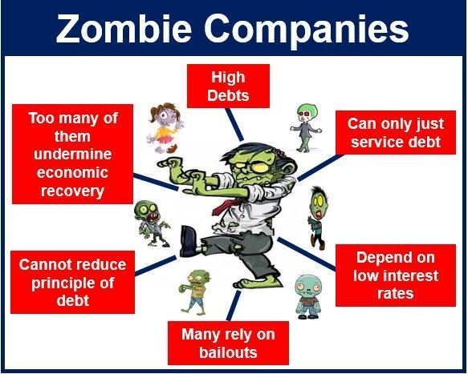

```{r include=FALSE}
library(knitr)

opts_chunk$set(dpi = 300, fig.align = "center", fig.width = 6, fig.height = 4, message = F, error = F, warning = F)

library(tidyverse)
library(readxl)

library(ggthemes)
library(htmlTable)
library(extrafont)
library(foreign)
library(plotly)
library(lubridate)
library(png)

loadfonts(device = "win")

theme_set(theme_minimal(base_size = 15, base_family = "STZhongsong"))

theme_update(
    panel.background = element_blank(),
    panel.grid.minor = element_blank(), 
    panel.grid.major = element_line(color = "gray50", size = 0.5),
    panel.grid.major.x = element_blank(),
    axis.ticks.length = unit(.25, "cm"),
    axis.ticks.x = element_line(colour = "gray50"),
    axis.ticks.y = element_blank(),
    axis.line.x = element_line(color = "gray50", size = 0.5)
)
```

## 什么是僵尸企业？

- 指这样一些负债企业，它们虽然可以产生现金流，但是扣除运营成本和固定成本之后，最多只能支付贷款利息，而无力偿还贷款本金

- 这样的企业本来应该死亡，但是依赖政府补贴或银行贷款勉强维持生存，并且无法恢复活力

```{r echo=FALSE, out.width=300}

```

---

## 为什么僵尸企业是有害的？

- 影响金融的资源配置效率(Caballero, Hoshi & Kashyap, 2008)
    - 劳动力市场
    - 生产效率
    - 企业投资的挤出效应

- 导致产能过剩(Shen & Chen, 2017)

---

## 资源配置：劳动力市场(I)

```{r echo=FALSE, out.width=700}

```
.remark-small[Source: Caballero, Hoshi & Kashyap (2008)]

---

## 资源配置：劳动力市场(II)

```{r echo=FALSE, out.width=700}

```
.remark-small[Source: Caballero, Hoshi & Kashyap (2008)]

---

## 资源配置：行业生产率

```{r echo=FALSE, out.width=700}

```
.remark-small[Source: Caballero, Hoshi & Kashyap (2008)]

---

## 资源配置：企业投资、就业与生产率

```{r echo=FALSE, out.width=700}

```
.remark-small[Source: Caballero, Hoshi & Kashyap (2008)]

---

## 产能过剩：省层面

```{r echo=FALSE, out.width=700}

```
.remark-small[Source: Shen & Chen (2017)]

---

## 产能过剩：行业层面

```{r echo=FALSE, out.width=700}

```
.remark-small[Source: Shen & Chen (2017)]

---

## 如何识别僵尸企业？

- 国务院标准：连续三年利润为负

- CHK方法(Caballero, Hoshi & Kashyap, 2008)
    - 如果一个企业为自己的债务所支付的利息非常低，甚至低于采用市场最低利率所要支付的利息，那么这个企业与银行之间的借贷关系就是非正常的，这个企业极有可能是依靠银行贷款才能生存的“僵尸企业”

- FN方法(Fukuda & Nakamura, 2011)
    - 在CHK的基础上通过引入了“盈利标准”，并修订了“持续信贷标准”

---

## CHK方法识别僵尸企业(I)

“最低应付利息”，即企业能获得市场最低利率时需要为其支付的利息：

$$R_{i,t}^* = rs_{t-1}BS_{i,t-1} + \left( \frac{1}{5} \sum_{j=1}^5 rl_{t-j} \right)BL_{i,t-1} + rcb_{min~over~5~years,t} \times Bonds_{i,t-1}$$

- $BS_{i,t}$, $BL_{i,t}$, $Bonds_{i,t}$ 分别代表企业i在t年末的短期银行贷款、长期银行贷款以及发行的债券总额(包括可转债和含权债)

- $rs_{t}$, $rl_{t}$, $rcb_{min~over~5~years,t}$ 分别为t年的平均短期最低利率、t年的平均长期最低利率以及在t年前5年发行的可转债的最低票面利率

---

## CHK方法识别僵尸企业(II)

将企业的实付利息 $R_{i,t}$ 与利息下限 $R_{i,t}^*$ 做比较

定义利率差距(interest rate gap)为
$$x_{i,t} = \frac{R_{i,t} - R_{i,t}^*}{B_{i,t-1}} = r_{i,t} - r_{i,t}^*$$

其中t年初企业i的总债务 $B_{i,t-1} = BS_{i,t-1} + BL_{i,t-1} + Bonds_{i,t-1} + CP_{i,t-1}$ ， $CP_{i,t-1}$ 是t年初企业i所发行的商业票据

---

## CHK(2008)识别出的日本僵尸企业(I)

```{r echo=FALSE, out.width=700}

```
.remark-small[Source: Caballero, Hoshi & Kashyap (2008)]

---

## CHK(2008)识别出的日本僵尸企业(II)

```{r echo=FALSE, out.width=700}

```
.remark-small[Source: Caballero, Hoshi & Kashyap (2008)]

---

## FN方法识别僵尸企业

- “盈利标准”（Profitability Criterion）：如果企业的息税前收入（EBIT）超过最低应付利息
$R_{i,t}^*$ ，则不被识别为僵尸企业

- “持续信贷标准”（Evergreen Lending Criterion）：如果企业t年的息税前收入低于最低应付利息 $R_{i,t}^*$ 、t-1年的外部债务总额超过其总资产的一半、并且t年的借贷有所增加，那么就将该企业识别为僵尸企业

---

## FN(2011)识别出的日本僵尸企业

```{r echo=FALSE, out.width=700}

```
.remark-small[Source: Fukuda & Nakamura (2011)]

---

## 针对中国工业企业的调整

- 谭语嫣等(2016)

    - CHK中用前后两年平均的企业负债水平替代滞后期的负债水平进行僵尸企业的测算
    
    - FN中用营业利润代替利润总额

- 黄少卿和陈彦(2017)

    - 扣除信贷补贴和政府补贴后实际利润总额连续三年之和为负
    
---

## 针对中国上市企业的调整

- 张栋等(2016)

    - 用扣除政府补贴的净利润代替净利润
    
- 黄少卿和陈彦(2017)
    
    - 上市公司分别计算t-2~t年、t-1~t+1年、t~t+2年的三个连续三年扣除信贷补贴和政府补贴后的实际利润总额进行加总，以上三个总和只要有一个小于0，则该企业在t年被识别为僵尸企业
    
---

## 参考文献

.remark-ref[
- Caballero, R., Hoshi, T., & Kashyap, A. (2008). Zombie lending and depressed restructuring in Japan. American Economic Review, 98(5), 1943–1977.

- Fukuda, S., & Nakamura, J. (2011). Why did ‘zombie’ firms recover in Japan? The World Economy, 34(7), 1124-1137.

- Shen, G., & Chen, B. (2017). Zombie firms and over-capacity in Chinese manufacturing. China Economic Review, 44, 327-342.

- 黄少卿,陈彦.中国僵尸企业的分布特征与分类处置[J].中国工业经济,2017(03):24-43.

- 谭语嫣,谭之博,黄益平,胡永泰.僵尸企业的投资挤出效应:基于中国工业企业的证据[J].经济研究,2017,52(05):175-188.

- 张栋,谢志华,王靖雯.中国僵尸企业及其认定——基于钢铁业上市公司的探索性研究[J].中国工业经济,2016(11):90-107.
]