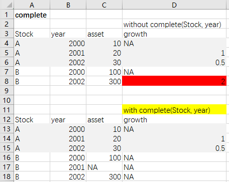
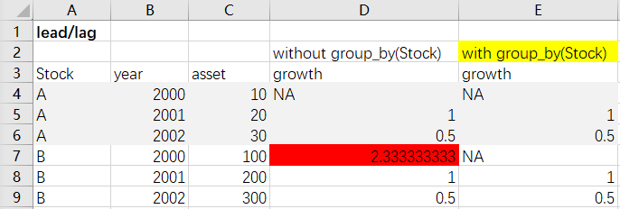
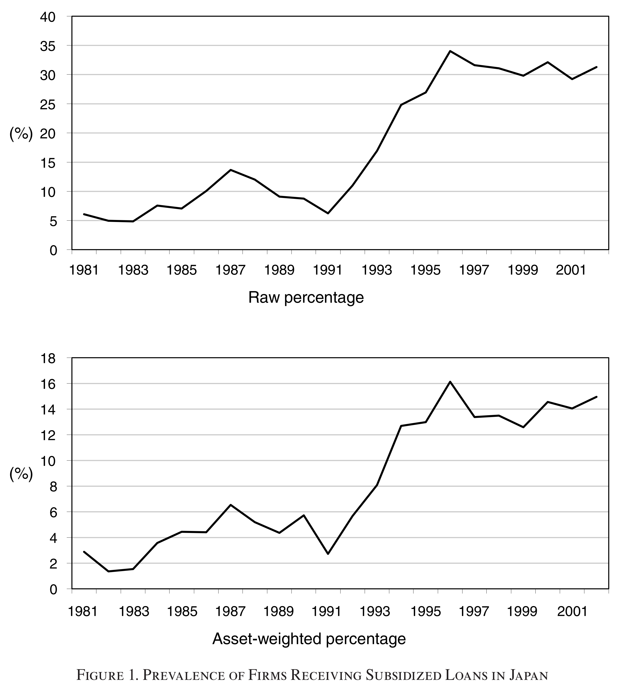

```{r setup, include=FALSE}
# knitr::opts_chunk$set(echo = TRUE)
library(knitr)
```

# 导言

## 目标

- 使用FN-CHK方法识别中国上市企业中的僵尸企业

- 使用改进的方法识别中国上市企业中的僵尸企业

## FN-CHK方法识别僵尸企业

1. CHK “持续信贷标准”：$R_{i,t} < R_{i,t}^*$，其中“最低应付利息”为
$$R_{i,t}^* = rs_{t-1}BS_{i,t-1} + \left( \frac{1}{5} \sum_{j=1}^5 rl_{t-j} \right)BL_{i,t-1} + rcb_{min~over~5~years,t} \times Bonds_{i,t-1}$$

- $BS_{i,t}$, $BL_{i,t}$, $Bonds_{i,t}$ 分别代表企业i在t年末的短期银行贷款、长期银行贷款以及发行的债券总额(包括可转债和含权债)

- $rs_{t}$, $rl_{t}$, $rcb_{min~over~5~years,t}$ 分别为t年的平均短期最低利率、t年的平均长期最低利率以及在t年前5年发行的可转债的最低票面利率


2. FN “盈利标准”：如果企业的EBIT超过最低应付利息 $R_{i,t}^*$ ，则不被识别为僵尸企业

3. FN “持续信贷标准”：如果企业t年的EBIT低于最低应付利息 $R_{i,t}^*$ 、t-1年的外部债务总额超过其总资产的一半、并且t年的借贷有所增加，那么就将该企业识别为僵尸企业

## 针对中国上市公司的改进方法

1. 考虑政府补贴和信贷补贴( $R_{i,t} < R_{i,t}^*$ ) ，将EBIT换成扣除政府补贴和信贷补贴后的实际利润总额

2. 分别计算t-2\~t年、t-1\~t+1年、t\~t+2年的三个连续三年扣除补贴后的实际利润总额进行加总，以上三个总和只要有一个小于0，则该企业在t年被识别为僵尸企业


## 数据来源

CSMAR(国泰安) http://cn.gtadata.com/

- 基本信息: 股票市场系列 -> 股票市场交易 -> 基本数据 -> 公司文件

- 财务数据: 

    - 公司研究系列 -> 财务报表 -> 资产负债表 / 利润表
    
    - 公司研究系列 -> 财务报表附注 -> 损益项目 -> 财务费用 / 非经常性损益

- 贷款利率信息：货币市场系列 -> 货币市场与政策工具 -> 利率及汇价 -> 金融机构贷款利率表

- 债券利率信息：债券市场系列 -> 债券市场 -> 基本情况 -> 可转债基本情况表


## 选取样本与变量

- 2003-2015年, 上海与深圳A股非金融上市公司

- 基本信息: 行业类别、市场类型

- 财务数据
    
    - 资产负债表：总资产、短期借款、应付票据、长期借款、应付债券
    
    - 利润表：销售收入、财务费用、利润总额、净利润
    
    - 财务报表附注
    
          - 财务费用：利息支出
          
          - 政府补助

- 利率信息

    - 短期贷款基准利率：2014年11月22日前选择六个月至一年，2014年11月22日后选择一年以内
    
    - 长期贷款基准利率：2014年11月22日前选择三年至五年，2014年11月22日后选择一年至五年
    
    - 可转债利率：票面利率

## 分解目标

- Step 1: 计算每年的贷款基准利率和最低可转债利率(已完成)，最低贷款利率为贷款基准利率下浮10%，即贷款基准利率的90%

- Step 2: 对上市公司各数据集进行初步筛选和清理

- Step 3: 合并上市公司基本信息、财务数据和利率信息

- Step 4: 计算最低应付利息、债务总额、扣除补贴的实际利润总额

- Step 5: 使用CHK方法、FN方法与改进的方法识别僵尸企业

- Step 6: 对识别结果进行描述性分析


# 准备工作
```{r warning=FALSE, message=FALSE}
# 加载需要的R包
library(tidyverse)
library(readxl)
library(lubridate)
library(kableExtra)
```

- 保存R Script, 并修改工作目录到R Script所在的文件夹(`Session -> Set Working Directory -> To Source File Location`)

- 所有数据都保存在该文件夹中的子文件夹"Zombie_data"中


# 导入数据
```{r warning=FALSE}
# 基本信息
cominfo <- read_excel("Zombie_data/TRD_Co.xlsx")

# 资产负债表
combas <- read_excel("Zombie_data/FS_Combas.xlsx", col_names = c("Stkcd", "Accper", "Typrep", "asset", "shortloan", "CP", "longloan", "bond"), skip = 3)

# 利润表
comins <- read_excel("Zombie_data/FS_Comins.xlsx", col_names = c("Stkcd", "Accper", "Typrep", "sales", "finexp", "profit", "npr"), skip = 3)

# 财务报表附注-财务费用
finexp <- read_excel("Zombie_data/FN_Fn051.xlsx")

# 财务报表附注-政府补助
subsidy <- read_excel("Zombie_data/FN_Fn056.xlsx")

# 利率信息
loan_intrate <- read_csv("Zombie_data/Loan_interest.csv")
bond_intrate <- read_csv("Zombie_data/Bond_interest.csv")
```


# 整理数据

## 财务报表初步筛选
```{r warning=FALSE}
combas <- combas %>% 
  mutate(
    Accper = ymd(Accper),
    year = year(Accper)
    ) %>% 
  filter(month(Accper) == 12, Typrep == "A")

comins <- comins %>% 
  mutate(
    Accper = ymd(Accper),
    year = year(Accper)
    ) %>% 
  filter(month(Accper) == 12, Typrep == "A")
```

## 筛选A股非金融类企业
```{r warning=FALSE}
com_A <- cominfo %>% 
  filter(
    (Markettype == 1 | Markettype == 4 | Markettype == 16), 
    Indcd != "0001"
    )
```

## 处理财务报表附注，找出需要的项目
```{r warning=FALSE}
# 利息支出
intexp <- finexp %>% 
  mutate(
    Accper = ymd(Accper),
    year = year(Accper)
    ) %>% 
  filter(
    month(Accper) == 12, 
    Typrep == 1,
    Sgnyea == 1,
    Fn05101 == 1,
    !is.na(Fn05102)
    ) %>% 
  rename(intexp = Fn05102) %>% 
  select(Stkcd, year, intexp)

# 计入营业外收入的政府补助
subsidy <- subsidy %>% 
  mutate(
    Accper = ymd(Accper),
    year = year(Accper)
  ) %>% 
  filter(
    month(Accper) == 12, 
    DataSources == "02", 
    Typrep == 1, 
    Fn05601 == "合计",
    !is.na(Fn05602)
    ) %>% 
  rename(subsidy = Fn05602) %>% 
  select(Stkcd, year, subsidy)
```


## 合并数据集

- Step 1: 合并资产负债表与利润表
```{r warning=FALSE}
tmp1 <- combas %>% 
  full_join(comins)
```

- Step 2: 合并财务报表附注
```{r}
tmp2 <- tmp1 %>% 
  left_join(intexp) %>% 
  left_join(subsidy)
```

- Step 3: 保留财务报表中的A股企业
```{r warning=FALSE}
tmp3 <- com_A %>% 
  left_join(tmp2)
```

- Step 4: 处理可能的极端情况
```{r warning=FALSE}
tmp4 <- tmp3 %>% 
  filter(asset > 0, sales >= 0)
```

- Step 5: 合并利率信息
```{r warning=FALSE}
tmp5 <- tmp4 %>% 
  left_join(loan_intrate) %>% 
  left_join(bond_intrate)
```


合并结果存储在`comdata`中
```{r warning=FALSE}
coms <- combas %>% 
  full_join(comins) %>% 
  left_join(intexp) %>% 
  left_join(subsidy)

comdata <- com_A %>% 
  left_join(coms) %>% 
  filter(asset > 0, sales >= 0) %>% 
  left_join(loan_intrate) %>% 
  left_join(bond_intrate)
```

处理缺失值
```{r warning=FALSE}
comdata <- comdata %>%
  mutate_at(
    c("shortloan", "CP", "longloan", "bond", "finexp", "intexp", "subsidy"), 
    ~replace_na(., 0)
    )
```

# 识别僵尸企业

## 构造变量

使用mutate构造所需变量:

- 最低应付利息 minint

- 外部债务总额 debt

- 扣除政府补贴和信贷补贴的利润总额 exprofit

```{r warning=FALSE}
comdata_all <- comdata %>% 
  mutate(
    interest = 0.9*short_rate/100*shortloan + 0.9*roll_long_rate/100*longloan + bond_rate/100*bond,
    debt = shortloan + CP + longloan + bond,
    EBIT = profit + finexp
  ) %>% 
  complete(Stkcd, year) %>% 
  arrange(Stkcd, year) %>% 
  group_by(Stkcd) %>% 
  mutate(
    minint = lag(interest),
    int_sub = if_else(intexp < minint, minint - intexp, 0),
    exprofit = profit - subsidy - int_sub,
    debt_lag = lag(debt),
    exprofit_lag = lag(exprofit),
    exprofit_lead = lead(exprofit),
    sumprofit = exprofit_lead + exprofit + exprofit_lag
  )
```

- 为何要用complete()?

```{r echo=FALSE, out.width=400}

```

- 如何正确使用lead()?

```{r echo=FALSE, out.width=600}

```


## FN-CHK方法识别僵尸企业

CHK识别标准

- “持续信贷标准”：利息支出低于minint

```{r warning=FALSE}
com_CHK <- comdata_all %>% 
  filter(year >= 2003, year <= 2015) %>% 
  mutate(
    zombie = case_when(
      is.na(minint) ~ NA_real_,
      intexp < minint ~ 1,
      TRUE ~ 0
    )
  )
```

FN识别标准

- “盈利标准”：如果企业EBIT超过minint，则不被识别为僵尸企业

- “持续信贷标准”：如果企业t年的EBIT低于minint、t-1年的debt超过其总资产的一半、并且t年的debt有所增加，那么就将该企业识别为僵尸企业

```{r warning=FALSE}
com_FN <- comdata_all %>% 
  filter(year >= 2003, year <= 2015) %>% 
  mutate(
    zombie = case_when(
      is.na(minint) ~ NA_real_,
      EBIT >= minint ~ 0,
      (EBIT < minint) & (debt_lag > 0.5*asset) & (debt > debt_lag) ~ 1,
      TRUE ~ 0
    )
  )
```


## 改进方法识别上市僵尸企业

- 分别计算t-2\~t年、t-1\~t+1年、t\~t+2年的三个连续三年exprofit进行加总，以上三个总和只要有一个小于0，则该企业在t年被识别为僵尸企业

```{r warning=FALSE}
com_zombie <- comdata_all %>% 
  mutate(
    sumprofit_lead = lead(sumprofit),
    sumprofit_lag = lag(sumprofit)
  ) %>% 
  filter(year >= 2003, year <= 2015) %>% 
  mutate(
    zombie = case_when(
      is.na(sumprofit_lead) | is.na(sumprofit) | is.na(sumprofit_lag) ~ NA_real_,
      (sumprofit_lead < 0) | (sumprofit < 0) | (sumprofit_lag < 0) ~ 1,
      TRUE ~ 0
    )
  )
```


# 僵尸企业的描述性统计

## 计算僵尸企业的数量与资产规模

```{r warning=FALSE}
# CHK方法
CHK <- com_CHK %>%
  filter(!is.na(zombie), !is.na(asset)) %>% 
  group_by(year) %>% 
  summarise(
    N = n(),
    `数量（个数）` = sum(zombie), 
    `数量占比（%）` = mean(zombie*100), 
    `资产（亿元）` = sum(zombie*asset/1e8), 
    `资产占比（%）` = weighted.mean(zombie*100, asset)
    )
CHK

# FN方法
FN <- com_FN %>%
  filter(!is.na(zombie), !is.na(asset)) %>% 
  group_by(year) %>% 
  summarise(
    N = n(),
    `数量（个数）` = sum(zombie), 
    `数量占比（%）` = mean(zombie*100), 
    `资产（亿元）` = sum(zombie*asset/1e8), 
    `资产占比（%）` = weighted.mean(zombie*100, asset)
    )
FN

# 改进后的方法
zombie <- com_zombie %>% 
  filter(!is.na(zombie), !is.na(asset)) %>% 
  group_by(year) %>% 
  summarise(
    N = n(),
    `数量（个数）` = sum(zombie), 
    `数量占比（%）` = mean(zombie*100), 
    `资产（亿元）` = sum(zombie*asset/1e8), 
    `资产占比（%）` = weighted.mean(zombie*100, asset)
    )
zombie
```

## 输出描述性统计结果

使用kableExtra包输出表格

- 僵尸企业的数量及其占比

```{r warning=FALSE, results='asis'}
cbind(
  zombie %>% select(`年份` = year, `数量（个数）`, `数量占比（%）`), 
  FN %>% select(`数量（个数）`, `数量占比（%）`),
  CHK %>% select(`数量（个数）`, `数量占比（%）`)
  ) %>% 
  kable(digits = 2) %>% 
  add_header_above(c(" " = 1, "改进方法" = 2, "FN方法" = 2, "CHK方法" = 2)) %>%
  kable_styling("striped")
```

- 僵尸企业的资产规模及其占比

```{r warning=FALSE}
cbind(
  zombie %>% select(`年份` = year, `资产（亿元）`, `资产占比（%）`), 
  FN %>% select(`资产（亿元）`, `资产占比（%）`),
  CHK %>% select(`资产（亿元）`, `资产占比（%）`)
  ) %>% 
  kable(digits = 2) %>% 
  add_header_above(c(" " = 1, "改进方法" = 2, "FN方法" = 2, "CHK方法" = 2)) %>%
  kable_styling("striped")
```

- 作图：使用改进方法识别出的僵尸企业数量占比与资产规模占比

```{r warning=FALSE}
zombie %>% 
  ggplot() +
  geom_line(aes(x = year, y = `数量占比（%）`), size = 1) +
  labs(x = "年份", y = "僵尸企业数量占比（%）") +
  scale_x_continuous(breaks = seq(2003, 2015, 2)) +
  scale_y_continuous(limits = c(0,40)) +
  theme_bw()
```

```{r warning=FALSE}
zombie %>% 
  ggplot() +
  geom_line(aes(x = year, y = `资产占比（%）`), size = 1) +
  labs(x = "年份", y = "僵尸企业资产规模占比（%）") +
  scale_x_continuous(breaks = seq(2003, 2015, 2)) +
  scale_y_continuous(limits = c(0,30)) +
  theme_bw()
```

- 与使用CHK(2008)对日本上市公司进行识别的结果进行对比

```{r echo=FALSE, out.width=600}

```