```{r include=FALSE}
library(knitr)

opts_chunk$set(dpi = 300, fig.align = "center", fig.width = 6, fig.height = 4, message = F, error = F, warning = F)

library(tidyverse)
library(readxl)
library(ggthemes)
library(htmlTable)
library(extrafont)
library(foreign)
library(plotly)
library(lubridate)

loadfonts(device = "win")

theme_set(theme_minimal(base_size = 15, base_family = "STZhongsong"))

theme_update(
    panel.background = element_blank(),
    panel.grid.minor = element_blank(), 
    panel.grid.major = element_line(color = "gray50", size = 0.5),
    panel.grid.major.x = element_blank(),
    axis.ticks.length = unit(.25, "cm"),
    axis.ticks.x = element_line(colour = "gray50"),
    axis.ticks.y = element_blank(),
    axis.line.x = element_line(color = "gray50", size = 0.5)
)
```

## 专题大纲

- 回顾实证资产定价文献

    - 了解重要的研究问题
    
    - 使用的研究方法
    
    - 中国实证资产定价研究思路与结论

- 如何做实证资产定价研究?

    - 详述经典的研究方法


---

## 2013年诺贝尔经济学奖

*"for their empirical analysis of asset prices”*

```{r echo=FALSE, out.width=650}

```

.remark-small[Source: The Prize in Economic Sciences 2013. NobelPrize.org.]

---

## 诺贝尔奖颁奖词

There is no way to predict the price of stocks and bonds over the next few days or weeks. But it is quite possible to **foresee the broad course of these prices over longer periods**, such as the next three to five years. These findings, which might seem both surprising and contradictory, were made and analyzed by this year’s Laureates, Eugene Fama, Lars Peter Hansen and Robert Shiller.

---

## 资产价格是可预测的吗?

- 时间序列角度
    - 短期
    - 长期
    
- 横截面角度
    - CAPM
    - 多因子模型

---

## 有效市场理论(EMH)

根据信息集的大小, 股票市场分为

- 弱有效市场(weak): 过去股价信息

- 半强有效市场(semi-strong): 公开市场信息, 如财务信息

- 强有效市场(strong): 所有信息, 包括公开和私人信息

---

## 弱有效市场

- 过去股价信息能否预测未来短期内(几天或几周)的股价?

- Fama and Blume(1966)发现股价基本是随机游走(random walk)

- 无套利理论基本成立

---

## 半强有效市场

- 各种信息一经公布, 股票价格将迅速调整到其应有的水平上

- Fama, Fisher, Jensen and Roll(1969)使用**事件研究法**研究股票分拆, 并发现当考虑分拆后的红利变化, 宣布分拆几乎没有带来任何超额收益

---

## 公司首次分红的股价反应

```{r echo=FALSE, out.width=700}
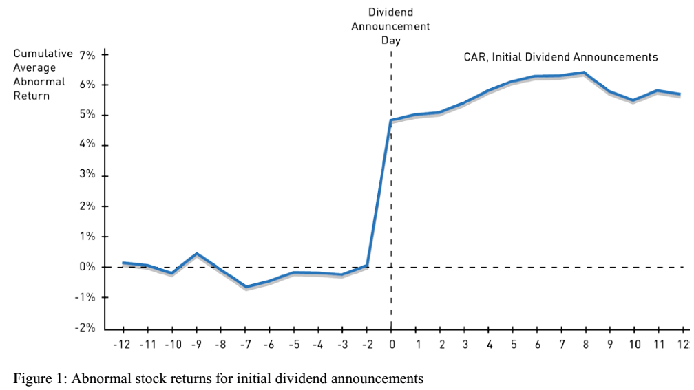
```

---

## 强有效市场

- 内部人交易(insider trading)的证据?

- Finnerty(1976)利用30,000个内部人的交易记录发现, 内部人无论买卖, 都可以击败市场, 获得超额收益

---

## 有效市场检验: 联合检验问题

- 预期收益率模型是否正确?

- 观测到的资产收益率是否与预期一致?

- 绝对有效市场 v.s. 相对有效市场

---

## 股票市场的超额波动率

Shiller(1981), Campbell and Shiller(1987)

$P_{i,t}^{*} = \sum_{k} m_{t+k}~d_{i,t+k}$ 基本面价值的实现值

$P_{i,t} = E_t[P_{i,t}^{*}]$ 预期基本面价值, 即股票价格

$P_{i,t}^{*} - P_{i,t}$ 预测误差

=> $Var(P_{i,t}^{*}) > Var(P_{i,t})$

---

## 预期基本面价值 v.s. 股票价格

```{r echo=FALSE, out.width=600}
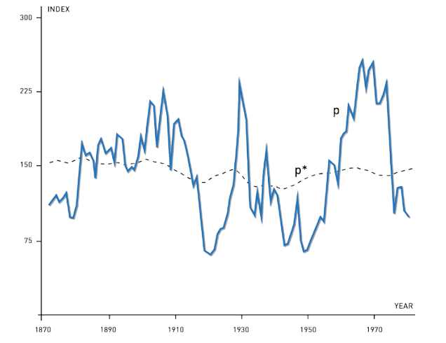
```

---

## 长期股市收益率可预测性

- 超额波动率的隐含意义: 资产价格会向均值回归(mean-reverting) -> 长期股市收益率可预测

- Shiller(1984): return-forecasting regression

```{r echo=FALSE, out.width=600}
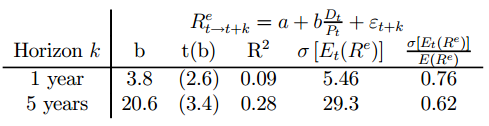
```

---

## Campbell-Shiller(1988)单期收益率分解

$$R_{t+1} = \frac{P_{t+1} + D_{t+1}}{P_t} = \left( 1 + \frac{P_{t+1}}{D_{t+1}} \right) \frac{D_{t+1}/D_t}{P_{t}/D_t}$$
$$r_{t+1} = \log(1+\exp(p_{t+1}-d_{t+1})) - (p_t - d_t) + \Delta d_{t+1}$$ 
=>

$$r_{t+1} \approx \rho (p_{t+1} - d_{t+1}) - (p_t - d_t) + \Delta d_{t+1}$$
其中 $\rho = \frac{P/D}{1+P/D} = \frac{1}{1+D/P} \approx \frac{1}{1.04} \approx 0.96$.

---

## Campbell-Shiller多期收益率分解

$$dp_{t} \approx \sum_{j=1}^{k} \rho^{j-1}\underbrace{r_{t+j}}_{\mathrm{discount}} - \sum_{j=1}^{k} \rho^{j-1}\underbrace{\Delta d_{t+j}}_{\mathrm{dividend}} + \rho^{k} \underbrace{dp_{t+k}}_{\mathrm{rational~"bubble"}}$$

其中 $dp_t \equiv d_t - p_t = \log(D_t/P_t)$.

---

## Long-run regressions

$$\sum_{j=1}^{k} \rho^{j-1}r_{t+j} = a_r + b_r^{(k)}dp_t + \epsilon_{t+k}^r,$$
$$\sum_{j=1}^{k} \rho^{j-1}\Delta d_{t+j} = a_d + b_d^{(k)}dp_t + \epsilon_{t+k}^d,$$
$$dp_{t+k} = a_dp + b_{dp}^{(k)}dp_t + \epsilon_{t+k}^{dp}.$$


=> 方差分解: 
$$\mathrm{Var}(dp_t) \approx \mathrm{Cov}\left[ dp_t, \sum_{j=1}^{k} \rho^{j-1}r_{t+j} \right] - \mathrm{Cov}\left[ dp_t, \sum_{j=1}^{k} \rho^{j-1}\Delta d_{t+j} \right] + \rho^k \mathrm{Cov}(dp_t, dp_{t+k})$$

---

## Long-run regression coefficients

$$1 \approx b_r^{(k)} - b_d^{(k)} + \rho^{k} b_{dp}^{(k)}$$

```{r echo=FALSE, out.width=650}
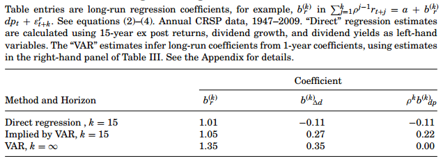
```

---

## 收益率时变可预测性: 1970s

- 预期收益率几乎不随时间变化, 短期股市收益率不可预测

- 股票价格波动对应着关于公司未来现金流(红利dividend)的消息的变化

```{r echo=FALSE, out.width=550}
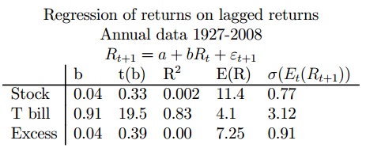
```

---

## 收益率时变可预测性: 1980s

- 预期收益率是时变的, 长期股市收益率可以预测

- 股票价格波动对应着贴现率(discount rate)的变化

```{r echo=FALSE, out.width=650}
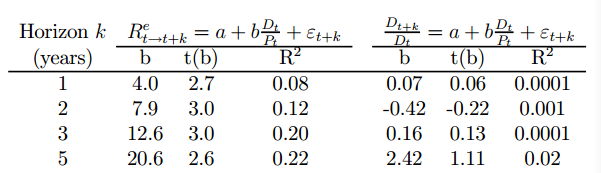
```

---

## 横截面股票收益率: CAPM

Sharpe(1964), Lintner(1965):

$$E[R_i] = R_f + \beta_{im}(E[R_m]-R_f)$$

$$\beta_{im} = \frac{\mathrm{Cov}[R_i, R_m]}{\mathrm{Var}[R_m]}$$

Black(1972): 不存在无风险利率证券

$$E[R_i] = E[R_{om}] + \beta_{im}(E[R_m]-E(R_{om}])$$
其中 $R_{om}$ 是零beta资产组合(zero-beta portfolio)的收益率

---

## 检验CAPM

第一步, 估计market beta

$$R_{it}-R_{ft} = \alpha_i + \beta_{i}(R_{mt}-R_{ft}) + e_{it}$$

第二步, 估计下面回归方程

$$R_{it} = \gamma_0 + \gamma_1\hat{\beta}_{it} + \epsilon_{it}$$
第三步, 检验 $\gamma_0 = R_f, \gamma_1 = R_m-R_f$

<!-- - 第一步, 使用五年数据估计market beta -->
<!-- - 第二步, 根据beta大小将公司分为10组 -->
<!-- - 第三步, 计算每组资产组合后面12个月的月度收益率 -->
<!-- - 第四步, 用投资组合收益率对beta作回归 -->

---

## Black-Jensen-Scholes(1972)

.pull-left[

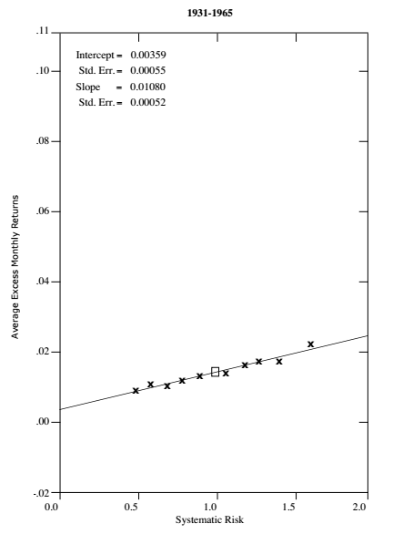

]

.pull-right[

- 资产组合收益率与Beta呈线性关系
- 截距项高于无风险利率(Rf)
- 斜率小于股票市场超额收益率(Rm-Rf)

]

---

## Fama-MacBeth(1973)

```{r echo=FALSE, out.width=650}
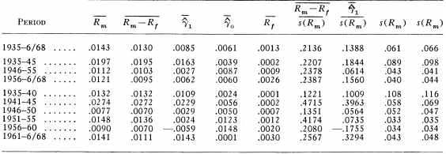
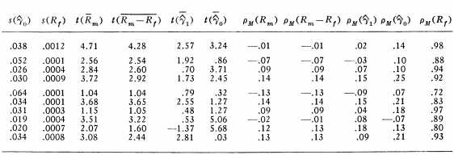
```

---

## CAPM异象(anomaly): 价值溢价(value premium)

```{r echo=FALSE, out.width=500}
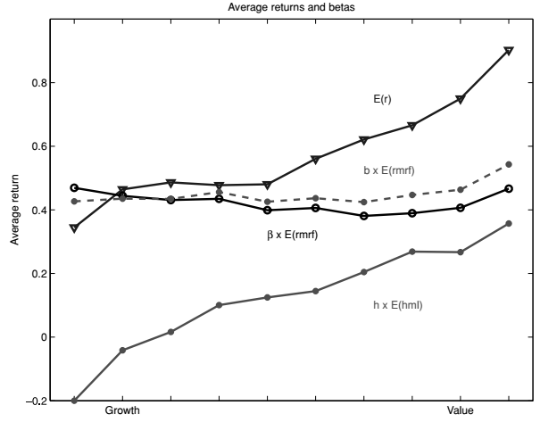
```

---

## 三因子模型

Fama and French(1993)

- 市场风险溢价因子(Market factor)

- 市值因子(SMB, Small-Minus-Big)

- 价值因子(HML, High-Minus-Low)

---

## 三因子模型的解释力

5*5 市值-价值投资组合的三因子模型R2

```{r echo=FALSE, out.width=650}
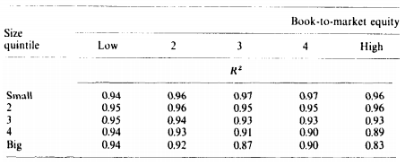
```

---

## 三因子模型alpha

5*5 市值-价值投资组合的三因子模型的截距项(即alpha)

```{r echo=FALSE, out.width=650}
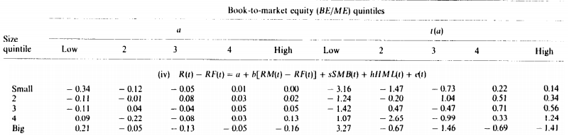
```

---

## 继续寻找alpha

$$R_{it} - R_{ft} = \alpha_i + b_i(R_{mt}-R_{ft}) + s_i SMB_t + h_i HML_t + \epsilon_{it}$$

- 动量(Momentum)

- 流动性

- 应计(Accural)

- ...

---

## 五因子模型

Fama and French(2015)

- 三因子

- 盈利因子(RMW, Robust-Minus-Weak)

- 投资因子(CMA, Conservative-Minus-Aggresive)

.remark-small[Download: http://mba.tuck.dartmouth.edu/pages/faculty/ken.french/data_library.html]

---

## 回顾已发现的异象

Hou, Xue, and Zhang(2017)

```{r echo=FALSE, out.width=650}
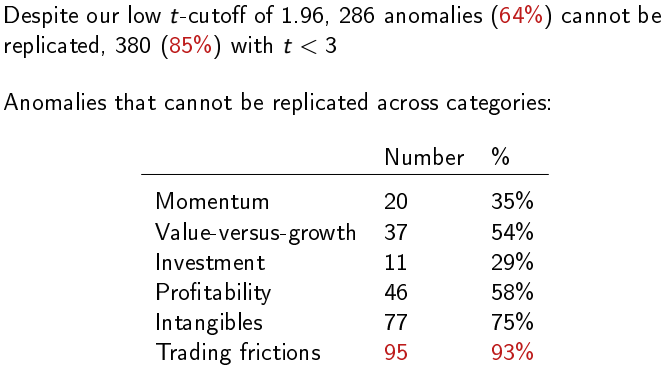
```

---

## 横截面收益率差异: 1970s

- CAPM可以解释横截面收益率差异

- Beta来源于公司现金流和整个市场现金流的协方差

---

## 横截面收益率差异: 1980以后

- 用多因子模型解释横截面收益率差异
    - 许多特征与预期收益率相关
    - 非市场beta越高, 预期收益率越高

- Beta来源于公司贴现率和整个市场贴现率的协方差

---

## 参考文献(I)

.remark-ref[
- Black, F. (1972). Capital market equilibrium with restricted borrowing. The Journal of Business, 45(3), 444-455.

- Black, F., Jensen, M. C., & Scholes, M. (1972). The capital asset pricing model: Some empirical tests. Studies in the theory of capital markets, 81(3), 79-121.

- Campbell, J. Y., & Shiller, R. J. (1987). Cointegration and tests of present value models. Journal of Political Economy, 95(5), 1062-1088.

- Fama, E. F., & Blume, M. E. (1966). Filter rules and stock-market trading. The Journal of Business, 39(1), 226-241.

- Fama, E. F., Fisher, L., Jensen, M. C., & Roll, R. (1969). The adjustment of stock prices to new information. International Economic Review, 10(1), 1-21.

- Fama, E. F., & French, K. R. (1993). Common risk factors in the returns on stocks and bonds. Journal of financial economics, 33(1), 3-56.
]

---

## 参考文献(II)

.remark-ref[
- Fama, E. F., & French, K. R. (2015). A five-factor asset pricing model. Journal of financial economics, 116(1), 1-22.

- Fama, E. F., & MacBeth, J. D. (1973). Risk, return, and equilibrium: Empirical tests. Journal of Political Economy, 81(3), 607-636.

- Finnerty, J. (1976). Insiders and market efficiency. Journal of Finance, 31, 1141–1148.

- Hou, K., Xue, C., & Zhang, L. (2017). Replicating anomalies. Review of Financial Studies, Forthcoming.

- Lintner, J. (1965). Security prices, risk, and maximal gains from diversification. The journal of finance, 20(4), 587-615.

- Sharpe, W. F. (1964). Capital asset prices: A theory of market equilibrium under conditions of risk. The journal of finance, 19(3), 425-442.
]

---

## 参考文献(III)

.remark-ref[
- Shiller, R. J. (1981). Do stock prices move too much to be justified by subsequent changes in dividends? The American Economic Review, 71(3), 421-436.

- Shiller, R. J. (1984). Stock Prices and Social Dynamics. Brookings Papers on Economic Activity, 2, 457–498.
]