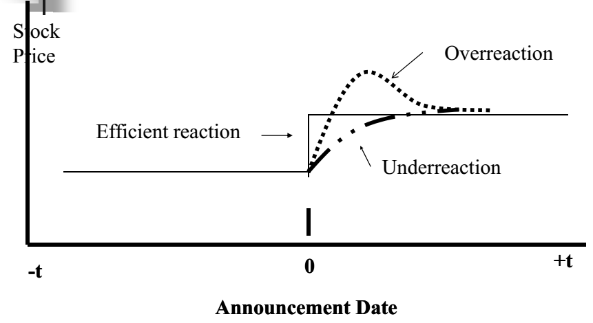
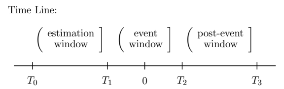
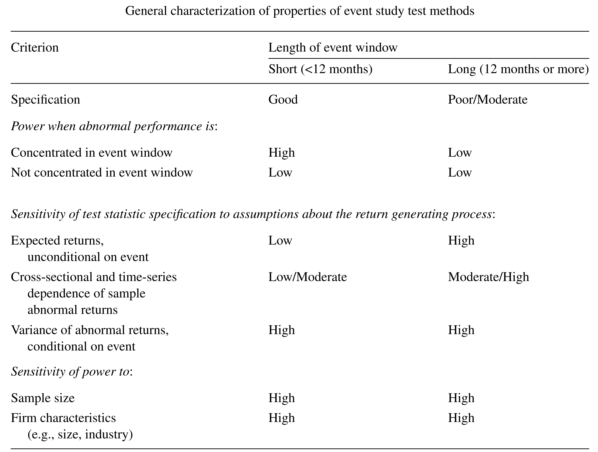
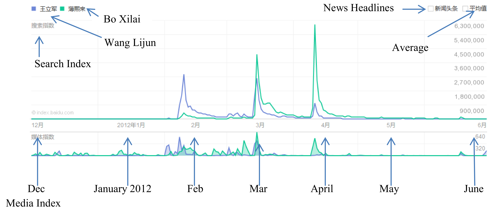
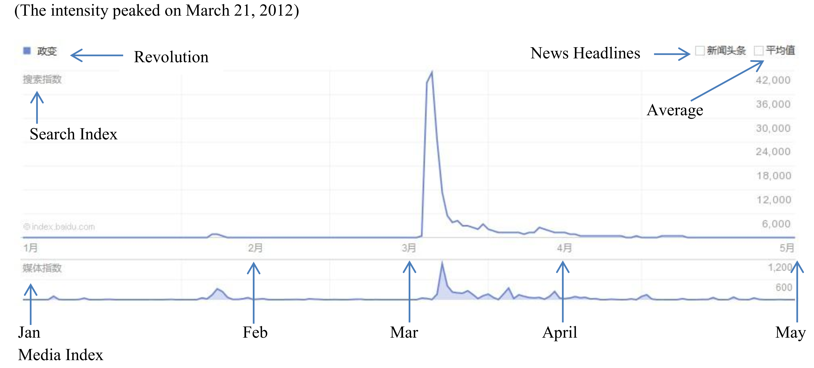
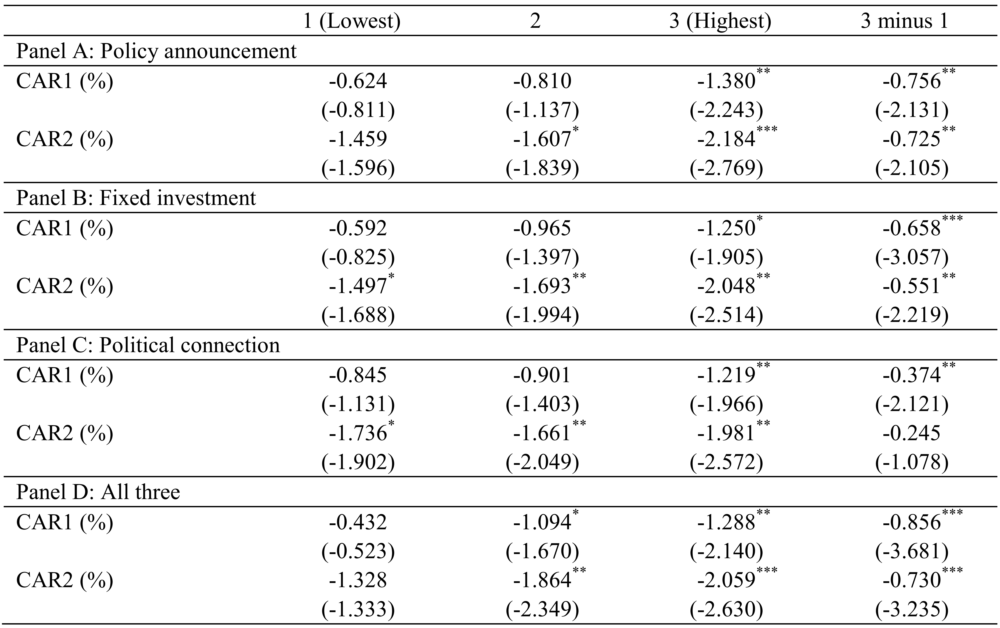
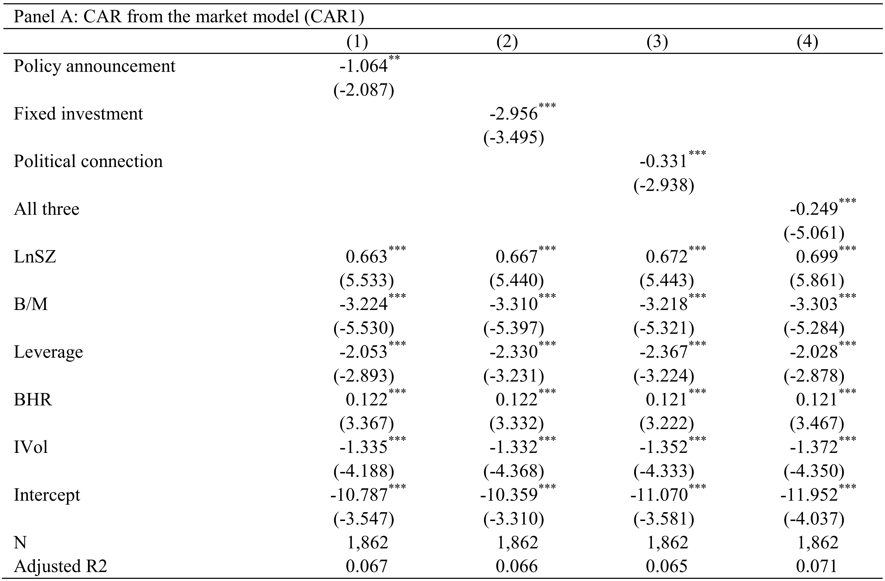
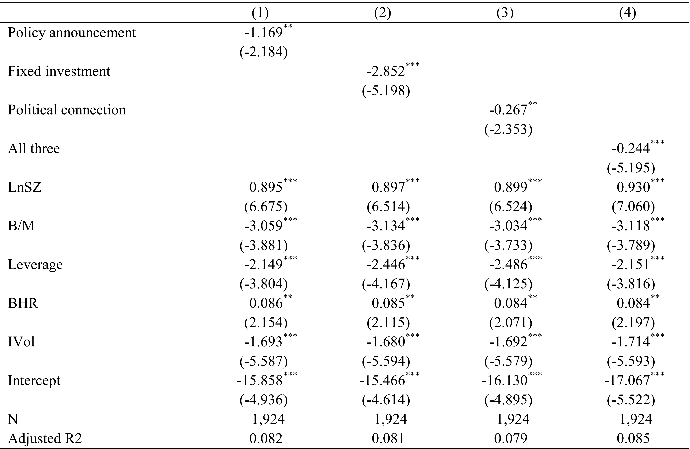

```{r include=FALSE}
library(knitr)

opts_chunk$set(dpi = 300, fig.align = "center", fig.width = 6, fig.height = 4, message = F, error = F, warning = F)

library(tidyverse)
library(readxl)
library(ggthemes)
library(htmlTable)
library(extrafont)
library(foreign)
library(plotly)
library(lubridate)
library(broom)
library(stargazer)

loadfonts(device = "win")

theme_set(theme_minimal(base_size = 15, base_family = "STZhongsong"))

theme_update(
    panel.background = element_blank(),
    panel.grid.minor = element_blank(), 
    panel.grid.major = element_line(color = "gray50", size = 0.5),
    panel.grid.major.x = element_blank(),
    axis.ticks.length = unit(.25, "cm"),
    axis.ticks.x = element_line(colour = "gray50"),
    axis.ticks.y = element_blank(),
    axis.line.x = element_line(color = "gray50", size = 0.5)
)
```

## 事件研究(Event study)

事件所引起的股票市场**反应**

- 短期事件研究（小于1年）

- 长期事件研究（大于等于1年）

MacKinlay, A. C. (1997). Event studies in economics and finance. Journal of Economic Literature, 35(1), 13-39.

Khotari, S. P. & Warner, J. B. (2006). Econometrics of Event Studies. Handbook of Corporate Finance: Empirical Corporate Finance, Volume A, Ch. 1.

---

## 基本假设

- 有效市场理论: 股价快速、有效地反映市场中的信息

- 事件是意料之外的

- 没有其他事件同时发生: 可以将观测到的股票市场反应与其他事件区分开来

---

## 事件研究的应用场景

- 资产定价: 市场有效性检验

- 公司金融: 公告效应

- 会计: 盈余公告

- 法律与经济: 法规改变

---

## 有效市场理论下的股价反应

```{r echo=FALSE, out.width=700}

```

---

## 事件研究步骤

1. 事件定义
2. 样本筛选
3. 异常收益率
4. 估计步骤
5. 检验步骤
6. 解释结果

---

## 事件定义

- 定义要研究的事件

- 事件窗口
    - 一般非常短, 公告事件往往选取事件发生前后几天(如[-1, 0], [0, 1], [-1, 1])
    - 包含事前日期(pre-event dates), 可以考察事件是否存在信息泄露
    - 包含事后日期(post-event dates), 可以考察市场对于事件的延迟反应

---

## 样本筛选

筛选标准可能根据数据可得性, 也可能根据所需的行业进行筛选

归纳一些样本特征(如公司市值、行业代表性、事件发生日期的分布等)

注意样本选择可能带来的样本偏差

---

## 异常收益率

$$AR_{it} = R_{it} - E[R_{it}|X_t]$$
其中 $AR_{it}, R_{it}, E(R_{it})$ 分别代表异常收益率、真实收益率和正常收益率 

异常收益率(abnormal return)指事件窗口时间内股票的真实收益率减去正常收益率(normal return)

正常收益率指如果事件不发生的股票预期收益率

---

## 预期收益率模型

- 常数均值模型
- 市场调整后的收益率模型
- 市场模型(类CAPM模型)
- Fama-French三因子模型或五因子模型
- 其他因子模型与APT模型
- 匹配公司(或匹配资产组合)

---

## 常用预期收益率模型

常数均值模型:

$$R_{it} = \mu_t + \varepsilon_{it}$$

其中 $E[\varepsilon_{it}] = 0, Var[\varepsilon_{it}] = \sigma_{\varepsilon_i}^2$

市场模型:

$$R_{it} = \alpha_i + \beta_i R_{mt} + \epsilon_{it}$$

其中 $E[\epsilon_{it}] = 0, Var[\epsilon_{it}] = \sigma_{\epsilon_i}^2$

---

## 事件研究的时间轴

```{r echo=FALSE, out.width=600}

```

- 事件日期: $t = 0$
- 事件窗口: $t \in (T_1, T_2]$
- 估计窗口: $t \in (T_0, T_1]$
- 后事件窗口: $t \in (T_2, T_3]$

---

## 估计步骤: 以市场模型为例

利用估计窗口的数据 $t \in (T_0, T_1]$ , 对下面方程中的参数 $\alpha_i, \beta_i$ 进行OLS估计

$$R_{it} = \alpha_i + \beta_i R_{mt} + \epsilon_{it}$$

矩阵形式：
$$\mathbf{R}_i = \mathbf{X}_i \theta_i + \epsilon_i$$

---

## 异常收益率

计算事件窗口 $t \in (T_1, T_2]$ 的异常收益率

$$\widehat{AR}_{it} = R^*_{it} - \hat{\alpha}_i - \hat{\beta}_i R^*_{mt} = R^*_{it} - X^*_{it} \hat{\theta}_i$$

矩阵形式：
$$\widehat{\mathbf{AR}}_{i} = \mathbf{R}^*_i - \hat{\alpha}_i - \hat{\beta}_i \mathbf{R}^*_m = \mathbf{R}^*_i - \mathbf{X}^*_i \hat{\theta}_i$$

---

## 检验步骤

- 定义原假设

- 加总异常收益率

- 检验统计显著性

---

## 原假设

原假设 $H_0$: 事件对股票收益率的均值与方差都没有影响

已知 $\widehat{\mathbf{AR}}_{i} = \mathbf{R}^*_i - \mathbf{X}^*_i \hat{\theta}_i, t \in (T_1, T_2]$

=> $\widehat{\mathbf{AR}}_{i} \sim N(\mathbf{0}, \mathbf{V}_i)$

---

## 原假设下异常收益率的分布

在原假设下，股票收益率满足 $\mathbf{R}^*_i = \mathbf{X}^*_i \theta_i + \epsilon^*_i$

\begin{aligned}
 E[\widehat{\mathbf{AR}}_{i}|\mathbf{X}^*_i] &= E[\mathbf{R}^*_i - \mathbf{X}^*_i \hat{\theta}_i | \mathbf{X}^*_i]\\
 &= E[(\mathbf{R}^*_i - \mathbf{X}^*_i \theta_i) - \mathbf{X}^*_i (\hat{\theta}_i-\theta_i) | \mathbf{X}^*_i] \\
 &= E[\epsilon^*_i - \mathbf{X}^*_i (\hat{\theta}_i-\theta_i) | \mathbf{X}^*_i] \\
 &= 0.
\end{aligned}

\begin{aligned}
 \mathbf{V}_i =& E[\widehat{\mathbf{AR}}_{i} \widehat{\mathbf{AR}}_{i}^T | \mathbf{X}^*_i] \\
 =& E\left[ [\epsilon^*_i - \mathbf{X}^*_i(\hat{\theta}_i-\theta_i)] [\epsilon^*_i - \mathbf{X}^*_i(\hat{\theta}_i-\theta_i)]^T | \mathbf{X}^*_i \right]\\
 =& E\left[ \epsilon_i^{*} \epsilon_i^{*T} - \epsilon_i^{*}(\hat{\theta}_i-\theta_i)^T \mathbf{X}^{*T}_i - \mathbf{X}^*_i(\hat{\theta}_i-\theta_i) \epsilon_i^{*T} \right.\\
 & \left. + \mathbf{X}^*_i(\hat{\theta}_i-\theta_i)(\hat{\theta}_i-\theta_i)^T \mathbf{X}^{*T}_i| \mathbf{X}^*_i \right] \\
 =& \mathbf{I} \sigma_{\epsilon_i}^2 + \mathbf{X}^*_i (\mathbf{X}_i^T \mathbf{X}_i)^{-1} \mathbf{X}^{*T}_i \sigma_{\epsilon_i}^2.
\end{aligned}


---

## 累计异常收益率(Cumulative Abnormal Return)

$$\widehat{\mathrm{CAR}}_i(T_1, T_2) = \sum_{t=T_1}^{T_2} \widehat{AR}_{it} = l^T \widehat{\mathrm{AR}}_i$$

$$\mathrm{Var}[\widehat{\mathrm{CAR}}_i(T_1, T_2)] = \sigma_i^2(T_1, T_2) = l^T \mathbf{V}_i l$$

根据原假设
$$\widehat{\mathrm{CAR}}_i(T_1, T_2) \sim N(0, \sigma_i^2(T_1, T_2))$$

---

## 标准化的CAR(Standardized CAR)

$$\widehat{\mathrm{SCAR}}_i(T_1, T_2) = \frac{\widehat{\mathrm{CAR}}_i(T_1, T_2)}{\hat{\sigma}_i(T_1, T_2)}$$

$$\widehat{\mathrm{SCAR}}_i(T_1, T_2) \sim t(T_1-T_0-2)$$

如果事件窗口足够长
$$\frac{\widehat{\mathrm{SCAR}}_i(T_1, T_2)}{\sqrt{\frac{T_1-T_0-2}{T_1-T_0-4}}} \sim^a N(0,1)$$

---

## 平均累计异常收益率

N个事件的平均累计异常收益率
$$\overline{\mathrm{CAR}}(T_1, T_2) = \frac{1}{N} \sum_{i=1}^N \widehat{\mathrm{CAR}}_i(T_1, T_2)$$

$$\mathrm{Var}[\overline{\mathrm{CAR}}(T_1, T_2)] = \bar{\sigma}^2(T_1, T_2) = \frac{1}{N^2}\sum_{i=1}^N \sigma_i^2(T_1, T_2)$$

---

## 检验CAR(I)

原假设下
$$\overline{\mathrm{CAR}}(T_1, T_2) \sim N(0, \bar{\sigma}^2(T_1, T_2))$$

检验统计量
$$J_1 = \frac{\overline{\mathrm{CAR}}(T_1, T_2)}{[\hat{\bar{\sigma}}^2(T_1, T_2)]^{\frac{1}{2}}} \sim^a N(0,1)$$
---

## 检验CAR(II)

$$\overline{\mathrm{SCAR}}(T_1, T_2) = \frac{1}{N} \sum_{i=1}^{N} \widehat{\mathrm{SCAR}_i}(T_1, T_2)$$

原假设下
$$\overline{\mathrm{SCAR}}(T_1, T_2) \sim^a N \left(0, \frac{T_1-T_0-2}{N(T_1-T_0-4)} \right) $$

检验统计量
$$J_2 = \left( \frac{N(T_1-T_0-4)}{T_1-T_0-2} \right)^{\frac{1}{2}} \overline{\mathrm{SCAR}}(T_1, T_2) \sim^a N(0,1)$$

---

## 如何选择检验统计量

取决于被择假设

- 不同股票的异常收益率为常数: 选择J2

- 方差大的股票的异常收益率更高: 选择J1

- 往往结果并不受J1或者J2的选择而改变

---

<!-- ## 检验的势(power) -->

<!-- 势: 被择假设成立，但没有拒绝原假设的可能性 -->

<!-- 降低势的主要因素: -->
<!-- - 事件数量太少 -->
<!-- - 事件窗口太长 -->
<!-- - 采样频率太低 -->
<!-- - 事件日期不确定 -->

<!-- --- -->

## 非参数检验

- 符号检验

$$J_3 = \left[ \frac{N^+}{N} -0.5 \right] \frac{N^{1/2}}{0.5} \sim N(0,1)$$

- 秩和检验

$$J_4 = \frac{1}{N} \sum_{i=1}^N \left( K_{i0} - \frac{T_2-T_1+1}{2}\right) \Big/ s(T_2-T_1) \sim N(0,1)$$

$$s(T_2-T_1) = \sqrt{\frac{1}{T_2-T_1}\sum_{t=T_1+1}^{T_2} \left( \frac{1}{N} \sum_{i=1}^N \left(K_{it}-\frac{T_2-T_1+1}{2} \right)\right)}$$
---

## 事件聚集(clustering)

检验的假设: 横截面上，股票的异常收益率不相关，故协方差为0。如果事件发生时间不重合，该假设基本成立。

事件如果都发生在同一时点

- 将股票异常收益率加总为投资组合异常收益率，并对整个投资组合的CAR进行检验

- 多元线性回归：解释变量为异常收益率；被解释变量--事件日期作为哑变量

---

## 累计异常收益率与横截面模型

横截面累计异常收益率可以被企业特征所解释

$$\mathrm{CAR}_i = \mathrm{Z}_i \theta + \eta_i$$

如果企业特征不仅影响企业价值，还影响事件发生的概率，那么上述回归存在选择性偏差，OLS估计系数是不一致的。但OLS给出了真实显著性水平的下限，Prabhala(1995)给出详细的讨论。

---

## 长期事件研究

联合检验问题: 异常收益率为0；预期收益率模型正确

- 预期收益率模型的估计误差会影响长期异常收益率估计

- 选择合适的预期收益率模型至关重要

---

## 预期收益率模型的估计误差

选择性偏误问题:
- 事件发生在企业异常表现后(如股票分拆)
- 事件样本包含了极端特征的企业(如低市值股票、极端市盈率股票)
- 事件发生基于企业前期异常表现(如反转投资策略)

历史股票收益率很可能是有偏的

=> 需要使用**事件发生后**的股票收益率来估计预期收益率

---

## 合适的预期收益率模型

- Fama-French三因子模型（市场因子+市值因子+价值因子）

- Carhart四因子模型（三因子+动量因子）

- Fama-French五因子模型（三因子+盈利因子+投资因子）

---

## Post-event risk-adjusted performance measurement

- BHAR(Buy-and-Hold Abnormal Return)方法

- Jensen's alpha方法(Calender-time portfolio方法)

---

# BHAR方法

- 基于企业特征匹配控制组企业，控制组企业的股票收益率代表了预期股票收益率

- 匹配方法
    - 1对1匹配：每个事件组企业根据企业特征（如企业市值、账面市值比、盈利能力、投资率）匹配一家非事件组企业
    - 1对多匹配：匹配一个非事件组投资组合，使得事件组企业的特征与这个投资组合的特征分在同一个五分位组中

---

## 计算并检验BHAR

对事件企业i, 计算T个月的BHAR

$$\mathrm{BHAR}_{i,T} = \prod_{t = 1}^T (1+R_{i,t}) - \prod_{t = 1}^T (1+R_{B,t})$$

对事件组企业加总
$$\overline{\mathrm{BHAR}}_T = \sum_{i=1}^N \frac{1}{N} \mathrm{BHAR}_{i,T}, ~~\sigma^2(\mathrm{BHAR}_{i,T}) = \sum_{i=1}^N \frac{(\mathrm{BHAR}_{i,T}-\overline{\mathrm{BHAR}_T})^2}{N-1}$$

检验统计量
$$t^{\mathrm{BHAR}} = \frac{\mathrm{BHAR}_T}{\sigma \big/ \sqrt{N}} \sim^a N(0,1)$$

---

# Jensen's alpha方法

\begin{aligned}
R_{pt} - R_{ft} = a_p &+ b_p (R_{mt}-R_{ft}) + s_p \mathrm{SMB}_{t} + h_p \mathrm{HML}_{t} \\
&+ r_p \mathrm{RMW}_{t} + c_p \mathrm{CMA}_{t} + e_{pt}, ~t \in (0,T]
\end{aligned}

其中 $R_{pt}$ 为过去T个月内发生事件的企业组成的投资组合的等权重(equal-weighted)或价值加权(value-weighted)收益率， $R_{ft}$ 是无风险利率， $R_{mt}$ 是市场组合收益率， SMB、HML、RMW、CMA分别是市值因子、价值因子、盈利因子和投资因子。

Jensen alpha: $a_p$ 估计了事件发生后T个月的平均月度收益率，代表异常收益率的估计

---

## 小结

```{r echo=FALSE}

```

---

## 事件研究实例

Liu, L. X., Shu, H., & Wei, K. J. (2017). The impacts of political uncertainty on asset prices: Evidence from the Bo scandal in China. Journal of Financial Economics, 125(2), 286-310.

研究问题：考察政治不确定性带来的企业股票市场反应

事件：2012年3月14日薄熙来事件

研究方法：短期事件研究（问题是只有一个事件）

具体做法：比较政治较为敏感的企业与政治较为不敏感的企业的股票市场反应

---

## 该事件带来的关注

百度搜索指数

```{r echo=FALSE}

```

---

## 该事件带来的政治不确定性

```{r echo=FALSE}

```

---

## 短期事件研究

- 事件日：2012年3月14日

- 事件窗口：[-1,1]，即2012/3/13-2012/3/15

- 估计窗口：2011/8/7-2012/2/6

- CAR (累计异常收益率)

    - CAR1: 市场模型(类CAPM模型)
    - CAR2: 市场调整后的收益率模型

- 针对一个事件日的调整

---

## 衡量企业的政治敏感程度

- 企业对货币政策的敏感程度：企业对于央行宣布调整存款准备金率的股票市场反应

- 企业对财政政策的敏感程度：企业所在省份总固定资产支出中政府支出的部分

- 企业的政治关联度：董事会成员中拥有政治关系的个数，这里政治关系指曾经或者正在中央政府、地方政府或者军队任职

---

## 分组结果

```{r echo=FALSE}

```

---

## 回归结果：CAR1

```{r echo=FALSE}

```

---

## 回归结果：CAR2

```{r echo=FALSE}

```

